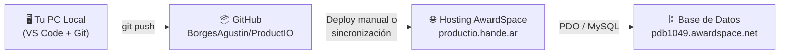
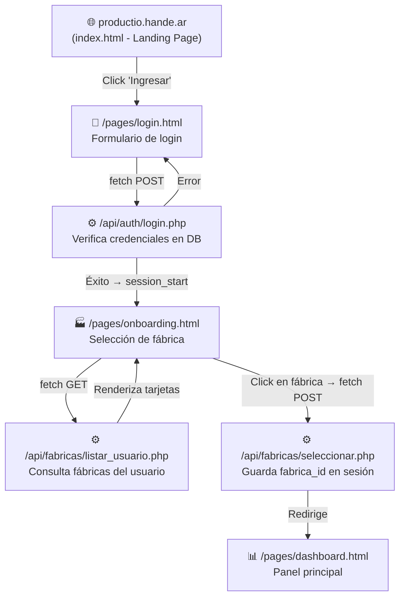

# ProductIO — Guía de Contexto Completo del Proyecto

## ¿Cómo se conecta todo?

El proyecto ProductIO tiene **3 componentes** que trabajan juntos:

---

## 1. Repositorio GitHub (Código Fuente)

| Dato | Valor |
|------|-------|
| **URL** | `https://github.com/BorgesAgustin/ProductIO.git` |
| **Rama principal** | `main` |
| **Último commit** | `35fb5e5` — *"Eliminación de archivos innecesarios"* (28/04/2026) |
| **Otra rama** | `prueba-entorno` (rama de pruebas iniciales, 2 commits) |

Este repositorio es **la fuente de verdad** del código. Contiene todos los archivos HTML, CSS, JS, PHP y SQL del proyecto.

---

## 2. Hosting en Producción (AwardSpace / hande.ar)

| Dato | Valor |
|------|-------|
| **URL pública** | `http://productio.hande.ar` |
| **Proveedor** | AwardSpace (runhosting.com) |
| **Landing** | `http://productio.hande.ar/` → sirve [index.html](file:///c:/Users/marco/OneDrive/Escritorio/Carpetas_Facultad/productio/index.html) |
| **Login** | `http://productio.hande.ar/pages/login.html` |
| **Onboarding** | `http://productio.hande.ar/pages/onboarding.html` |

### ¿Cómo llegan los archivos al hosting?

Los archivos del repositorio GitHub se suben al hosting de AwardSpace **manualmente** (vía FTP o panel de control de AwardSpace). No hay un pipeline de CI/CD automático configurado.

El hosting ejecuta PHP y sirve los archivos `.html` como PHP gracias a la configuración del [.htaccess](file:///c:/Users/marco/OneDrive/Escritorio/Carpetas_Facultad/productio/.htaccess).

> [!IMPORTANT]
> **Problema detectado con HTTPS:** El certificado SSL del hosting está configurado para `p49-preview.runhosting.com`, no para `productio.hande.ar`. Esto significa que el sitio solo funciona correctamente por **HTTP** (`http://`), no por HTTPS. Los navegadores modernos mostrarán una advertencia de seguridad si se intenta acceder por HTTPS.

> [!WARNING]
> **PHP no se ejecuta en la URL del onboarding:** Al acceder a `http://productio.hande.ar/pages/onboarding.html`, el servidor devuelve el **código PHP crudo sin procesar** (se ven los tags `<?php ... ?>`). Esto indica que el `.htaccess` no está funcionando correctamente en el hosting, o que el servidor no tiene habilitado el procesamiento de `.html` como PHP.

---

## 3. Base de Datos MySQL Remota

| Dato | Valor |
|------|-------|
| **Host** | `pdb1049.awardspace.net` |
| **Base de datos** | `3434352_productio` |
| **Usuario** | `3434352_productio` |
| **Conexión** | PDO con `utf8mb4` |

Configurada en [config/database.php](file:///c:/Users/marco/OneDrive/Escritorio/Carpetas_Facultad/productio/config/database.php).

### Tablas actuales:

| Tabla | Propósito |
|-------|-----------|
| `usuarios` | Usuarios del sistema (id, username, email, password hash, nombre) |
| `fabricas` | Fábricas/entornos de trabajo (id, nombre, dirección) |
| `usuario_fabricas` | Relación muchos-a-muchos entre usuarios y fábricas (con rol) |

---

## Flujo Completo del Usuario

---

## Mapa de Archivos: Repositorio ↔ URL en Producción

| Archivo Local | URL en Producción | Estado |
|---------------|-------------------|--------|
| [index.html](file:///c:/Users/marco/OneDrive/Escritorio/Carpetas_Facultad/productio/index.html) | `http://productio.hande.ar/` | ✅ Funciona (HTML puro) |
| [pages/login.html](file:///c:/Users/marco/OneDrive/Escritorio/Carpetas_Facultad/productio/pages/login.html) | `http://productio.hande.ar/pages/login.html` | ⚠️ Requiere PHP activo |
| [pages/onboarding.html](file:///c:/Users/marco/OneDrive/Escritorio/Carpetas_Facultad/productio/pages/onboarding.html) | `http://productio.hande.ar/pages/onboarding.html` | ❌ PHP no se ejecuta |
| [pages/dashboard.html](file:///c:/Users/marco/OneDone/Escritorio/Carpetas_Facultad/productio/pages/dashboard.html) | `http://productio.hande.ar/pages/dashboard.html` | ⚠️ Requiere PHP + sesión |
| [assets/css/styles.css](file:///c:/Users/marco/OneDrive/Escritorio/Carpetas_Facultad/productio/assets/css/styles.css) | `http://productio.hande.ar/assets/css/styles.css` | ✅ Archivo estático |
| [assets/js/*.js](file:///c:/Users/marco/OneDrive/Escritorio/Carpetas_Facultad/productio/assets/js) | `http://productio.hande.ar/assets/js/*.js` | ✅ Archivos estáticos |
| [api/auth/login.php](file:///c:/Users/marco/OneDrive/Escritorio/Carpetas_Facultad/productio/api/auth/login.php) | `http://productio.hande.ar/api/auth/login.php` | ⚠️ Depende de DB activa |
| [api/fabricas/*.php](file:///c:/Users/marco/OneDrive/Escritorio/Carpetas_Facultad/productio/api/fabricas) | `http://productio.hande.ar/api/fabricas/*.php` | ⚠️ Depende de DB activa |

---

## Problemas Detectados

### 🔴 Críticos

1. **PHP no procesa archivos `.html` en el hosting**: El archivo `onboarding.html` devuelve código PHP crudo. El `.htaccess` con `AddHandler application/x-httpd-php .html` no está funcionando en AwardSpace.

2. **Certificado SSL inválido**: El HTTPS no funciona porque el certificado está emitido para el dominio genérico de runhosting, no para `productio.hande.ar`.

### 🟡 Inconsistencias en el código

3. **Links del sidebar apuntan a `.php` en vez de `.html`**: En [sidebar.php](file:///c:/Users/marco/OneDrive/Escritorio/Carpetas_Facultad/productio/partials/sidebar.php) los enlaces dicen `dashboard.php`, `clientes.php`, etc., pero los archivos reales son `.html`.

4. **Credenciales expuestas en Git**: El archivo [config/database.php](file:///c:/Users/marco/OneDrive/Escritorio/Carpetas_Facultad/productio/config/database.php) contiene las credenciales de la base de datos en texto plano y está versionado en el repositorio público.

5. **`.gitignore` vacío**: No se excluyen archivos sensibles ni temporales.

---

## Resumen del Estado Actual

| Aspecto | Estado |
|---------|--------|
| **Código en GitHub** | ✅ Sincronizado (main, commit 35fb5e5) |
| **Landing page en producción** | ✅ Funciona correctamente |
| **Login en producción** | ⚠️ Depende de que PHP procese .html |
| **Onboarding en producción** | ❌ PHP no se ejecuta, muestra código crudo |
| **Dashboard en producción** | ❌ Mismo problema que onboarding |
| **Base de datos** | ⚠️ Configurada pero no verificada la conectividad |
| **Pantallas futuras** (clientes, productos) | 🔲 No existen aún |
